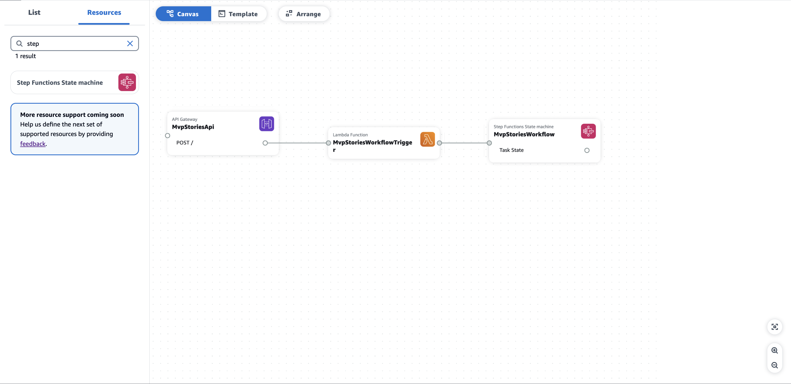
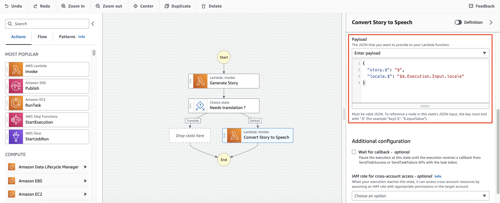
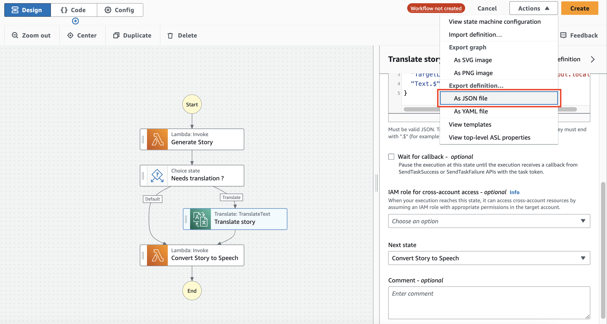
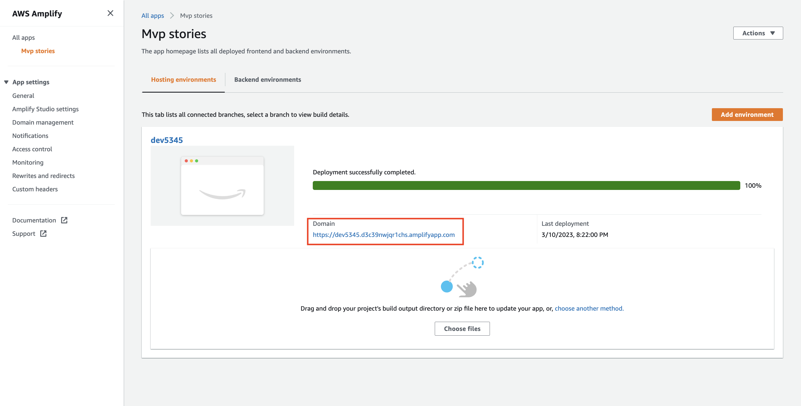

# Build a serverless GenAI MVP with AWS Application Composer

## Prerequisites

In order to proceed with the demo, you should have the following:
- [AWS CLI](https://docs.aws.amazon.com/cli/latest/userguide/getting-started-install.html) installed
- [AWS SAM](https://docs.aws.amazon.com/serverless-application-model/latest/developerguide/install-sam-cli.html) installed
- [Configure your AWS credentials](https://docs.aws.amazon.com/cli/latest/userguide/cli-chap-configure.html)
- Download the contents of this directory to use it when going over the demo.
- Make sure to enable the Anthropic Claude Instant V1 model from the [Bedrock console](https://console.aws.amazon.com/bedrock/home#/modelaccess)

## What we are building

In this demo, we want to assess how we can use AWS Application Composer and other AWS tools in order to create an MVP on AWS. For the purpose of this demo, we want to be able to generate children stories in mp3 format by giving in the context of our story as well as the language in which we want our story to be narated. We want to be able to access our mvp on any browser.

## Architecture

This is the architecture of the solution we are going to build:


1. Serve frontend with **AWS Amplify Hosting**
2. Call **Amazon API Gateway** backend
3. Trigger an **AWS Lambda function** from API Gateway
4. Trigger a syncronous execution of **AWS Step Functions workflow** from the Lambda function
5. Call **Anthropic Claude Instant V1 model** through **Amazon Bedrock** to generate a unique story
6. Translate story if needed with **Amazon Translate**
7. Convert story to speech with **Amazon Polly**
8. Store generated story in an **Amazon S3** bucket
9. Return mp3 **URL** to frontend

## Demo

### Build the backend with Application Composer

Now we will start building the backend of our solution. In order to do so, we will be leveraging [AWS Application Composer](https://aws.amazon.com/application-composer/).

1. Let's start by downloading the contents of this directory on your local computer. You should have two directories:
   - `mvp-stories/backend`
   - `mvp-stories/frontend`
2. Head to the [Application Composer console](https://console.aws.amazon.com/composer/home)
3. Click on **create project**
4. Drag and drop an API Gateway resource into the canvas

1. Click on the resource
2.   Click on **Details**
3.   Enter the logical ID to be **MvpStoriesApi**

1.   Scroll down to the routes section and change the **GET** method to **POST**
2.   Click on Add **corsallowedorigins** and set value to **\***
    > NOTE: All origins allowed for simplicity and the purpose of this demo, can be changed later to only allow the actual frontend making the requests
3.   Repeat for **CORS allowed headers** and **CORS allowed methods**
4.   Click save

1.   Add the Lambda resource that will be triggered from API Gateway.
    
2.   Click on **Details**
3.   Enter the logical ID to be **MvpStoriesWorkflowTrigger**
4.   Update **Source path** field to `src/handlers`. This is the location where your Lambda code will be stored locally.
5.   Update **Handler** field to `workflowTrigger.handler`. This is the name of the js file containing the Lambda code and the relative handler method that is exposed
6.   Click save
    
7.   Connect the created **MvpStoriesApi** to the **MvpStoriesWorkflowTrigger**
    
8.   Add a Step Function resource to the canvas
    
9.   Click on **Details**
10. Set the logical ID the Step Function resource to **MvpStoriesWorkflow**
11. Click save
    
12. Link the **MvpStoriesWorkflowTrigger** resource to **MvpStoriesWorkflow** resource
    
13. Drag an additional Lambda function resource, similarly to the firstly created Lambda function resource. Change the following details for your function:
    - Logical ID to **MvpStoriesTextToSpeech**
    - Source path to `src/handlers`
    - Handler to `textToSpeech.handler`
    - Add the following IAM policy in the Permissions section:
      ```yaml
      - Statement:
        - Effect: Allow
          Action:
            - polly:*
          Resource:
            - '*'
      ```
      This will give the permission to your Lambda function to call the Amazon Polly service which is needed for the Text to Speech conversion of our story.
    
14. Drag and drop an S3 Bucket resource. Change the logical ID to **MvpStoriesBucket**
15. Link the **MvpStoriesTextToSpeech** resource with tge **MvpStoriesBucket** resource
  
16.  Drag an additional Lambda function resource, similarly to the firstly created Lambda function resource. Change the following details for your function:
    - Logical ID to **MvpStoriesBedrock**
    - Source path to `src/handlers`
    - Handler to `bedrock.handler`
    - Add the following IAM policy in the Permissions section:
      ```yaml
      - Statement:
        - Effect: Allow
          Action: bedrock:InvokeModel
          Resource: '*'
      ```
      This will give the permission to your Lambda function to invoke your LLM through Amazon Bedrock.
    
17. Click on the **template** tab and copy the contents. This IaC (Infrastructure as Code) template describes your serverless architecture using [AWS SAM (Serverless Application Model)](https://aws.amazon.com/serverless/sam/). Paste the copied code to a `template.yaml` in your backend folder `mvp-stories/backend`.
  

### Build the Step Function workflow logic

Currently the Step Function workflow resource in your Application Composer canvas contains a basic state machine definition. We actually want to create a state definition that matches our use case presented in the architecture.

1. Let's open a new tab and head to the Step Function console.
2. Click on Create state machine
    
3. Choose authoring method as **Design your workflow visually**
4. Choose **Express** type of workflow (as for the sake of this demo, we will be running everything syncronously)
5. Click next
    
6. Drag and drop an AWS Lamba Invoke state.
7. Change the state name to **Generate Story**
8. Under API parameters, choose the function name to be **Enter function name** and `${MvpStoriesBedrockArn}` as shown on the image below. This value will be dynamically filled in with the actual ARN of our Lambda function when our backend is deployed:
    
9.   Now we need to know whether our story needs translation or not. In order to do so, we need to make a choice. Drag and drop a **Choice** state after the **Generate Story** state. 
10.  Change the state name to **Needs translation ?**
11.  Click on the edit icon of Rule 1
    
12. Enter the **Needs translation** in the comment section
13. Click on Add conditions
    
14. Set condition for rule one as follows:
    - Not: **NOT**
    - Variable: **$$.Execution.Input.locale** (value of **locale** provided as input to statemachine)
    - Operator: **is equal to**
    - Value: **String constant**
    - **en**
15. Click **Save conditions**
    
16. Let's start with the case where the story does not need translation. Drag and drop an AWS Lamba Invoke step.
17. Change the state name to **Convert Story to Speech**
18. Under API parameters, choose the function name to be **Enter function name** and `${MvpStoriesTextToSpeechArn}` as shown on the image below. This value will be dynamically filled in with the actual ARN of our Lambda function when our backend is deployed:
  
19. Under **Payload** select **Enter Payload** and fill in the following payload:
      ```json
      {
        "story.$": "$",
        "locale.$": "$$.Execution.Input.locale"
      }
      ```
      
        With this, we are creating a json to be passed to the **MvpStoriesTextToSpeech** Lambda function execution.
        
20. Now lets handle the case were we actually need to translate our story. Drag and drop a Translate TranslateText step for the **Needs Translation** branch
21. Change the state name to **Translate story**
22. Change the API parameters for the Amazon Translate call to the following json:
    ```json
    {
      "SourceLanguageCode": "en",
      "TargetLanguageCode.$": "$$.Execution.Input.locale",
      "Text.$": "$"
    }
    ```
    
23.    Similarly to the **Generate Story** step, we want to pass the translated story as input to the next state. Let's filter out the story from the result of the TranslateText call
    1.  Click on Output
    2.  Select the **Filter output with OutputPath** option and type:
          ```
          $.TranslatedText
          ```
        

24. After our **Translate story** step, we want to perform the same steps as the **Default** branch of our Choice state.
    1.  Click on Configuration
    2.  Select **Next state** to be the **Prepare input for textToSpeech** state
  
25. Now that our workflow is setup, we can export it by clicking on **Import/Export**
26. Click on **Export JSON definition**
    
27. Copy the downloaded file to your backend folder and name the file `statemachine.asl.json`

### Finalize the backend locally

There are a few things that we need to modify in our `template.yaml` file to make our application behave as we want to (and that we unfortunately cannot do directly in Application Composer at the time of writing this document).

1. Head to the resource called **MvpStoriesWorkflow**. Remove the **Defininition** key from that resource and replace it with:
    ```yaml
    DefinitionUri: ./statemachine.asl.json
    ```
    Here, we are informing SAM where to find our workflow definition that we created from the Step Function console.

2. Add another key to **MvpStoriesWorkflow**:
   ```yaml
   DefinitionSubstitutions:
      MvpStoriesTextToSpeechArn: !GetAtt MvpStoriesTextToSpeech.Arn
      MvpStoriesBedrockArn: !GetAtt MvpStoriesBedrock.Arn
   ```
   This addition allows us to dynamically pass the name of the 2 Lambda functions we will be using in our state machine (MvpStoriesTextToSpeech and MvpStoriesBedrock)

3. We need to add a few permissions to **MvpStoriesWorkflow**, add the following permissions under the **Policies** key:
   ```yaml
    Policies:
      ...EXISTING_POLICIES...
      - Statement:
          - Effect: Allow
            Action:
              - translate:*
            Resource:
              - '*'
      - LambdaInvokePolicy:
          FunctionName: !Ref MvpStoriesTextToSpeech
      - LambdaInvokePolicy:
          FunctionName: !Ref MvpStoriesBedrock
   ```
   This gives the permission to **MvpStoriesWorkflow** to call the Amazon Translate service and invoke the two lambda functions used in our workflow.

4. Change the **Type** key of **MvpStoriesWorkflow** from `STANDARD` to `EXPRESS`. This will allow us to invoke our Step Function workflow synchronously.
5. Head to the **MvpStoriesWorkflowTrigger** and change the **Policies** key from 
      ```yaml
      Policies:
        - StepFunctionsExecutionPolicy:
            StateMachineName: !GetAtt MvpStoriesWorkflow.Name
      ```
      to
      ```yaml
      Policies:
        - Statement:
            - Effect: Allow
              Action: states:StartSyncExecution
              Resource: !GetAtt MvpStoriesWorkflow.Arn
      ```
      This will give the permission to the **MvpStoriesWorkflowTrigger** Lambda function to invoke the **MvpStoriesWorkflow** resource synchrounously.

6. Finally, go to the end of the `template.yml` document and paste the following code:
    ```yaml
    Outputs:
      MvpStoriesApi:
        Description: "API Gateway endpoint URL for Prod stage"
        Value: !Sub "https://${MvpStoriesApi}.execute-api.${AWS::Region}.amazonaws.com/Prod/"
    ```
    This change will make sure that everytime you deploy your application with SAM, the API Gateway endpoint will be printed as output.

Now that we have our IaC settled, there is a last thing we need to take care of before being able to deploy. In Application Composer, we have defined 2 Lambda resources. We have defined their configuration but we did not define the actual code contained in those Lambda functions. Let's do this now.

1. create a the `src/handlers` in your `backend` directory.
2. In the `src/handlers` folder run the following commands:
      ```bash
      npm init
      npm install @aws-sdk/client-bedrock-runtime
      ```
      This will allow you to import and use the Bedrock runtime client from within your Lambda functions
3. Create a `src/handlers/workflowTrigger.mjs` file and type in the following code
    ```js
    import { SFNClient, StartSyncExecutionCommand } from "@aws-sdk/client-sfn"

    export const handler = async (event) => {
      const body = JSON.parse(event.body)
      const sfnInput = {
        stateMachineArn: process.env.MVPSTORIESWORKFLOW_STATE_MACHINE_ARN,
        input: JSON.stringify({ context: body.context, locale: body.locale || 'en' })
      }
      const sfnClient = new SFNClient()
      const sfnCommand = new StartSyncExecutionCommand(sfnInput)
      const sfnResponse = await sfnClient.send(sfnCommand)
      return {
        statusCode: 200,
        headers: {
          "Access-Control-Allow-Headers" : "*",
          "Access-Control-Allow-Origin": "*", 
          "Access-Control-Allow-Methods": "*"
        },
        body: JSON.stringify(JSON.parse(sfnResponse.output))
      }
    }
    ```
    This code will handle the request incoming from API Gateway, call the Step Function workflow syncronously and return the formatted results.
4. Create a `src/handlers/bedrock.mjs` file and type in the following code
    ```js
    import { BedrockRuntimeClient, InvokeModelCommand } from "@aws-sdk/client-bedrock-runtime"
    const client = new BedrockRuntimeClient()

    export const handler = async (event) => {
      const command = new InvokeModelCommand({
        "modelId": "anthropic.claude-instant-v1",
        "contentType": "application/json",
        "accept": "*/*",
        "body": JSON.stringify({
          "prompt": `\n\nHuman: Write an approx 100 words long children story about ${event.context}. Only provide the generated story as response, no leading text. \n\nAssistant:`,
          "max_tokens_to_sample": 300,
          "temperature": 1,
          "top_k": 250,
          "top_p": 0.999,
          "stop_sequences": [
              "\n\nHuman:"
          ],
          "anthropic_version": "bedrock-2023-05-31"
        })
      })
      const response = await client.send(command)
      return Buffer.from(response.body).toString('utf8')
    }
    ```
    This code will call the Anthropic Claude Instant V1 model from Amazon Bedrock with a given prompt. Feel free to test out any other text generation model from Bedrock. Make sure to enable the model from the [Bedrock console](https://console.aws.amazon.com/bedrock/home#/modelaccess) before trying to use it in this demo.
5. Create a `src/handlers/textToSpeech.mjs` file and type in the following code
    ```js
    import { PollyClient, SynthesizeSpeechCommand } from "@aws-sdk/client-polly"
    import { S3Client, GetObjectCommand } from "@aws-sdk/client-s3"
    import { Upload } from "@aws-sdk/lib-storage"
    import { getSignedUrl } from "@aws-sdk/s3-request-presigner";
    import { randomUUID } from 'crypto'

    export const handler = async (event) => {   
      const pollyInput = {
        Engine: "neural",
        OutputFormat: 'mp3',
        Text: event.story,
        VoiceId: getVoiceId(event.locale),
      }
      const pollyClient = new PollyClient()
      const pollyCommand = new SynthesizeSpeechCommand(pollyInput)
      const pollyResponse = await pollyClient.send(pollyCommand)
      
      const mp3FileName = `${randomUUID()}.mp3`
      const signedUrlExpiresIn = 60 * 5

      const s3UploadInput = {
        Body: pollyResponse.AudioStream,
        Bucket: process.env.MVPSTORIESBUCKET_BUCKET_NAME,
        Key: mp3FileName,
        ContentType: 'audio/mpeg'
      }
      const s3Client = new S3Client()
      const s3Upload = new Upload({
        client: s3Client,
        params: s3UploadInput,
      })
      await s3Upload.done()

      const s3GetObjectInput = { Bucket: process.env.MVPSTORIESBUCKET_BUCKET_NAME, Key: mp3FileName }
      const s3GetObjectCommand = new GetObjectCommand(s3GetObjectInput)
      const mp3Url = await getSignedUrl(s3Client, s3GetObjectCommand, { expiresIn: signedUrlExpiresIn })
      
      return { ...event, mp3Url }
    }

    const getVoiceId = locale => {
      if (locale == 'fr') return "Lea"
      if (locale == 'nl') return "Laura"
      if (locale == 'ar') return "Hala"
      if (locale == 'it') return "Bianca"
      return "Joanna"
    }
    ```
    This code will syntetize speech of the translated story or original story, it will upload the results to an S3 bucket and will generate a presigned URL on which users will be able to access the audio version of the children story and return that along with the input event.

### Deploying the backend

Now that we have everything in place we can deploy our backend. In order to do so we will need to run 2 commands:
1. From the root of your `backend` directory, run `sam build`
2. Run `sam deploy --guided`
   This command will ask for some information regarding your deployment, you can fill the values in as follows:
   
   > Note: It will warn you that MvpStoriesWorkflowTrigger has no Authorization defined. Explicetely allow it for the sake of this demo.

At the end of your deployment results, you should be able to find the outputs that should look like this:

Copy the API endpoint and test your api with the following command
```sh
  curl --location 'API_ENDPOINT' \
  --header 'Content-Type: application/json' \
  --data '{
      "context": "a baby sphynx lost in an Egyptian pyramid",
      "locale": "fr"
  }'
```
The result should contained a presigned URL to access the mp3 version of your story.

### Deploying the frontend

Now that you have a fully functional API, let's include that in our frontend. For the sake of this example, we have created a very basic vue3 application with a basic UI that we will be deploying with AWS Amplify Hosting.

1. Let's head to our Vue application and more specifically to the part of our application submitting our request to our API.
2. Let's update the API endpoint to the one generated by SAM when deploying our backend.
3. Now that our frontend is ready, let's build the static files in order to be able upload them on AWS Amplify Hosting. With vue3, this can be done running the `npm install` and `npm run build` commands. This will create the necessary html, css and js files in a `dist` directory.
4. Let's now head to the [Amplify console](https://console.aws.amazon.com/amplify/home?#/create).
5. Select option **Deploy without Git provider**
6. Click on Continue
  
7. Enter the name of your Amplify application, eg: **Mvp Stories**
8. Drag and drop the `dist` folder containing your html, css and js files to be used for hosting.
9. Click **Save and deploy**
  
10. Once deployed, you will see a page telling you that the deployment is successful and will be able to access your app on the link provided.
  

You should now be able to test out your app, which makes a request to your backend and displays an mp3 story you can play from your webapp.


## Potential improvements

For the sake of the demo, we have kept many things simple and have taken some shortcuts. This is intended as the main value out of this demo is for you to understand how you can leverage Application Composer and other serverless technologies to quickly build your MVP.

It is not intended to be a guide for you to build a production ready product as many things could/should be improved before doing so. 

A few ideas on how to improve on the current solution:
- Do not deploy your solution manually but integrate your git provider with a CI/CD pipeline responsible for deploying your solution:
  - The `sam pipeline` command can help you setup a deployment pipeline. More information about this [here](https://aws.amazon.com/blogs/compute/introducing-aws-sam-pipelines-automatically-generate-deployment-pipelines-for-serverless-applications/)
  - Amplify hosting can be directly connected to your git provider, meaning that on every push, it would re-build your frontend and deploy it for you.
- Have different deployments for different environments
- Let your application work `async` by submitting the request, integrating API Gateway with Step Functions directly (without the need to go through a Lambda invocation) and working with websockets to notify the user when the story has been generated.
- ...
