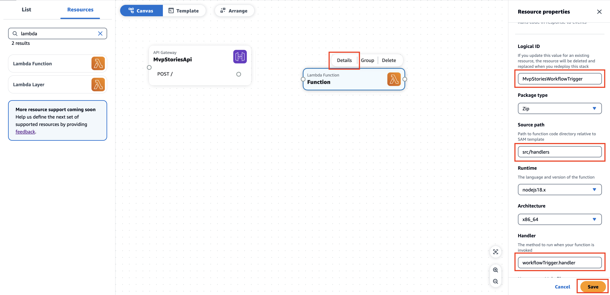
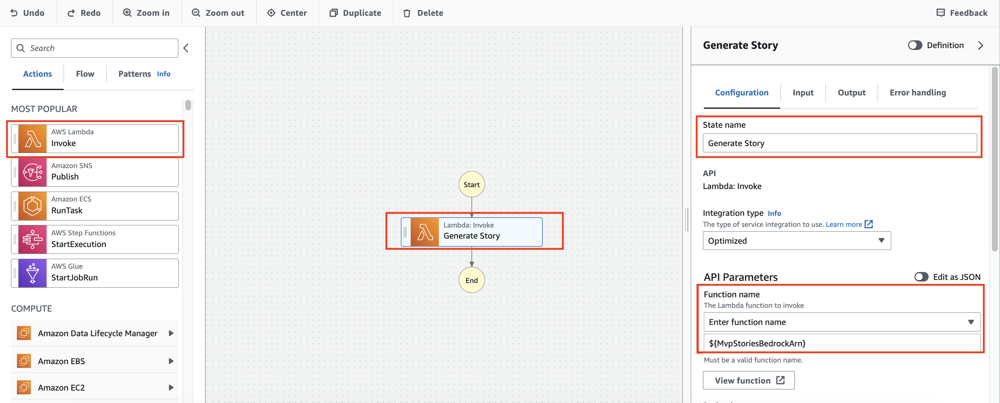

# Build a serverless GenAI MVP with AWS Application Composer

## Prerequisites

In order to proceed with the demo, you should have the following:
- [AWS CLI](https://docs.aws.amazon.com/cli/latest/userguide/getting-started-install.html) installed
- [AWS SAM](https://docs.aws.amazon.com/serverless-application-model/latest/developerguide/install-sam-cli.html) installed
- [Configure your AWS credentials](https://docs.aws.amazon.com/cli/latest/userguide/cli-chap-configure.html)
- Download the contents of this directory to use it when going over the demo.

## What we are building

In this demo, we want to assess how we can use AWS Application Composer and other AWS tools in order to create an MVP on AWS. For the purpose of this demo, we want to be able to generate children stories in mp3 format by giving in the context of our story as well as the language in which we want our story to be narated. We want to be able to access our mvp on any browser.

## Architecture

This is the architecture of the solution we are going to build:


1. Serve frontend with **AWS Amplify Hosting**
2. Call **Amazon API Gateway** backend
3. Trigger an **AWS Lambda function** from API Gateway
4. Trigger a syncronous execution of **AWS Step Functions workflow** from the Lambda function
5. Call **Falcon TII’s LLM** through **Amazon Sagemaker endpoint** to generate a unique story
6. Translate story if needed with **Amazon Translate**
7. Convert story to speech with **Amazon Polly**
8. Store generated story in an **Amazon S3** bucket
9. Return mp3 **URL** to frontend

## Demo

### Deploy your LLM

During this demo, we will be performing API calls to a LLM. In order to deploy our LLM, we will be using [Sagemaker Jumpstart](https://docs.aws.amazon.com/sagemaker/latest/dg/studio-jumpstart.html). 

1. Head to the [Amazon Sagemaker domains console](https://console.aws.amazon.com/sagemaker/home#/studio)
2. Click on **Create Domain**
  
3. Choose the name of your domain and user profile.
4. Click on **Submit**.
  
5. Click on the Sagemaker domain you just created
   
6. Launch Sagemaker Studio
  
7. Click on **Sagemaker Jumpstart -> Models, notebooks, solutions**
  
8. Look for **falcon**
9. Select **Falcon 7B Instruct BF16** and click on **View model**
  
10. Click on **Deploy**
  
  > Note: You might receive an error informing you that you have available instance to deploy your endpoint to. You might need to request a quota increase for this type of instance [here](https://console.aws.amazon.com/servicequotas/home/services/sagemaker/quotas).
11.  Take note of the endpoint ARN and name
  

The deployment of your Sagemaker endpoint should take about 5-10 minutes. We will continue with the rest of the app in the meantime. 

### Build the backend with Application Composer - Part 1

Now we will start building the backend of our solution. In order to do so, we will be leveraging [AWS Application Composer](https://aws.amazon.com/application-composer/).

1. Let's start by downloading the contents of this directory on your local computer. Alternatively, start by creating a directory on your local computer called `mvp-stories`. This directory should contain two subdirectories, one for our frontend, one for our backend. Create the two directories:
   - `mvp-stories/backend`
   - `mvp-stories/frontend`
2. Head to the [Application Composer console](https://console.aws.amazon.com/composer/home)
3. Click on **create project**
4. Drag and drop an API Gateway resource into the canvas

1. Click on the resource
2.   Click on **Details**
3.   Enter the logical ID to be **MvpStoriesApi**

1.   Scroll down to the routes section and change the **GET** method to **POST**
2.   Click on Add **corsallowedorigins** and set value to **\***
    > NOTE: All origins allowed for simplicity and the purpose of this demo, can be changed later to only allow the actual frontend making the requests
3.   Repeat for **CORS allowed headers** and **CORS allowed methods**
4.   Click save

1.   Add the lambda resource that will be triggered from API Gateway.
    
2.   Click on **Details**
3.   Enter the logical ID to be **MvpStoriesWorkflowTrigger**
4.   Update **Source path** field to `src/handlers`. This is the location where your lambda code will be stored locally.
5.   Update **Handler** field to `workflowTrigger.handler`. This is the name of the js file containing the lambda code and the relative handler method that is exposed
6.   Click save
    
7.   Connect the created **MvpStoriesApi** to the **MvpStoriesWorkflowTrigger**
    
8.   Add a Step Function resource to the canvas
    
9.   Click on **Details**
10. Set the logical ID the Step Function resource to **MvpStoriesWorkflow**
11. Click save
    
12. Link the **MvpStoriesWorkflowTrigger** resource to **MvpStoriesWorkflow** resource
    
13. Drag an additional lambda function resource, similarly to the firstly created lambda function resource. Change the following details for your function:
    - Logical ID to **MvpStoriesTextToSpeech**
    - Source path to `src/handlers`
    - Handler to `textToSpeech.handler`
    
14. Drag and drop an S3 Bucket resource. Change the logical ID to **MvpStoriesBucket**
15. Link the **MvpStoriesTextToSpeech** resource with tge **MvpStoriesBucket** resource
  

### Build the Step Function workflow logic

Currently the Step Function workflow resource in your Application Composer canvas contains a basic state machine definition. We actually want to create a state definition that matches our use case presented in the architecture.

1. Let's open a new tab and head to the Step Function console.
2. Click on Create state machine
    
3. Choose authoring method as **Design your workflow visually**
4. Choose **Express** type of workflow (as for the sake of this demo, we will be running everything syncronously)
5. Click next
    
6. Drag and drop a SageMaker Runtime InvokeEndpoint action in your workflow.
7. Set the name of the state to **Generate Story**
8. Under API parameters, paste the JSON below. Those parameters will be used for the SageMaker endpoint invocation. Note that we are building a prompt based on the provided context as well as passing the name of the SageMaker endpoint we have previously deployed.
  
    ```json
    {
      "ContentType": "application/json",
      "Body": {
        "inputs.$": "States.Format('Write a 80-120 words long children story about {}', $.context)",
        "parameters": {
          "max_new_tokens": 300
        }
      },
      "EndpointName": "NAME_OF_YOUR_SAGEMAKER_ENDPOINT"
    }
    ```

9. We will want to pass the generated story as input to the next state. Let's filter out the story from the result of the SageMaker endpoint invocation:
   1. Select the **Output** tab
   2. Select the **Transform result with ResultSelector** option and type
        ```json
        {
          "body.$": "States.StringToJson($.Body)"
        }
        ```
        This will allow us to transform the stringified json body in an actual json
   3. Select the **Filter output with OutputPath** option and type
        ```
        $.body[0].generated_text
        ```
        This will allow us to extract the generated text/story and pass it to the next state
  
10.  Now that we need to know wether our story needs translation or not. In order to do so, we need to make a choice. Drag and drop a **Choice** state after the **Generate Story** state. 
11.  Change the state name to **Needs translation ?**
12.  Click on the edit icon of Rule 1
    
13. Enter the **Needs translation** in the comment section
14. Click on Add conditions
    
15. Set condition for rule one as follows:
    - Not: **NOT**
    - Variable: **$$.Execution.Input.locale** (value of **locale** provided as input to statemachine)
    - Operator: **is equal to**
    - Value: **String constant**
    - **en**
16. Click **Save conditions**
    
17. Let's start with the case where the story does not need translation. Let's drag and drop a **Pass** state to transform the current state of the state machine to be passed to the next step.
18. Change the state name to **Prepare input for textToSpeech**
  
19. Click on Input
20. Select **Transform input with Parameters**
21. Fill in the following json
    ```json
    {
      "story.$": "$",
      "locale.$": "$$.Execution.Input.locale"
    }
    ```
    
    With this, we are creating a json to be passed to the next state with the generated story and the requested language of the story.

22. Drag and drop an AWS Lamba Invoke step after the **Prepare input for textToSpeech** state.
23. Change the state name to **Convert Story to Speech**
24. Under API parameters, choose the function name to be **Enter function name** and **TBD** as shown on the image below (this is a dummy value as the lambda function does not exist yet. It will be updated later on in Application Composer):
    
25. Now lets handle the case were we actually need to translate our story. Drag and drop a Translate TranslateText step for the **Needs Translation** branch
26. Change the state name to **Translate story**
27. Change the API parameters for the Amazon Translate call to the following json
    ```json
    {
      "SourceLanguageCode": "en",
      "TargetLanguageCode.$": "$$.Execution.Input.locale",
      "Text.$": "$"
    }
    ```
  

28. Similarly to the **Generate Story** step, we want to pass the translated story as input to the next state. Let's filter out the story from the result of the TranslateText call
    1.  Click on Output
    2.  Select the **Filter output with OutputPath** option and type:
        ```
        $.TranslatedText
        ```
    
  

29. After our **Translate story** step, we want to perform the same steps as the **Default** branch of our Choice state.
    1.  Click on Configuration
    2.  Select **Next state** to be the **Prepare input for textToSpeech** state
  
30. Now that our workflow is setup, we can export it by clicking on **Import/Export**
31. Click on **Export YAML definition**
    
32. Copy the contents of the downloaded file

### Build the backend with Application Composer - Part 2

1. Go back to your Application Composer project.
2. Click on your **MvpStoriesWorkflow** resource
3. Paste the content of the downloaded state machine definition into the input field of your resource
4. Click on save
    
5. Link the **Convert Story to Speech** state in **MvpStoriesWorkflow** with the corresponding **MvpStoriesTextToSpeech** lambda resource
    
    > Note: This is where Application composer will update the dummy function name **TBD** we had set out when defining Lambda invoke states in our Step Function workflow and place a dynamic reference to the Lambda resources that will be created from the SAM template generated by Application Composer.
6. In order for our **MvpStoriesTextToSpeech** lambda function to be allowed to call the Amazon Polly service, we will want to add some permissions to our function.
   1. Click on the resource
   2. Scroll down to the permissions section. (note that some permissions to access the S3 bucket have already been automatically created by Application Composer 🦄)
   3. Add the following permissions in the permissions tab
      ```yaml
      - Statement:
        - Effect: Allow
          Action:
            - polly:*
          Resource: 
            - "*"
      ```
   4. Click Save
  

7. We are now done with Application Composer
   1. Click the Template tab
   2. You will see a **yaml** template that we will use to deploy our backend with AWS SAM. Copy the contents of this template, we will use it in the next section.
  
### Finalize the backend locally

The template file created by Application Composer is IaC (Infrastructure as Code) describing your serverless architecture using [AWS SAM (Serverless Application Model)](https://aws.amazon.com/serverless/sam/).

There are a few things that we need to modify in this template to make our application behave as we want to (and that we unfortunately cannot do directly in Application Composer at the time of writing this document).

1. Paste the contents of the template in a file called `template.yaml` in your backend folder.
2. Search for the key `Resources.MvpStoriesWorkflow.Properties.Type` and change it from **STANDARD** to **EXPRESS**.
    > Note: For the sake of this demo, we are running our application syncronously. In order to be able to call our Step Function workflow syncronously, we need it to be of Type EXPRESS.
3. Search for the key `Resources.MvpStoriesWorkflowTrigger.Properties.Policies` and change the content of this key from
    ```yaml
    Policies:
      - StepFunctionsExecutionPolicy:
          StateMachineName: !GetAtt MvpStoriesWorkflow.Name
    ```
    to
    ```yaml
    Policies:
      - Statement:
          - Effect: Allow
            Action: states:StartSyncExecution
            Resource: !GetAtt MvpStoriesWorkflow.Arn
    ```
    With this change we are allowing the lambda function to call our step function workflow in a syncronous way.
4. Search for the key `Resources.MvpStoriesWorkflow.Properties.Policies` and add the following policies:
    ```yaml
    - Statement:
      - Effect: Allow
        Action:
          - sagemaker:InvokeEndpoint
        Resource:
          - !Sub arn:aws:sagemaker:${AWS::Region}:${AWS::AccountId}:endpoint/NAME_OF_YOUR_SAGEMAKER_ENDPOINT
    - Statement:
      - Effect: Allow
        Action:
          - translate:*
        Resource:
          - '*'
    ```
    Those policies allow your Step Function workflow to invoke the SageMaker endpoint you deployed and to run the translation job with Amazon Translate.
5. Head to the end of the `template.yml` document and paste the following code:
    ```yaml
    Outputs:
      MvpStoriesApi:
        Description: "API Gateway endpoint URL for Prod stage"
        Value: !Sub "https://${MvpStoriesApi}.execute-api.${AWS::Region}.amazonaws.com/Prod/"
    ```
    This change will make sure that everytime you deploy your application with SAM, the API Gateway endpoint will be printed as output.

Now that we have our IaC settled, there is a last thing we need to take care of before being able to deploy. In application composer, we have defined 2 lambda resources. We have defined their configuration but we did not define the actual code contained in those lambda functions. Let's do this now.

1. create a the `src/handlers` in your `backend` directory.
2. Create a `src/handlers/workflowTrigger.mjs` file and type in the following code
    ```js
    import { SFNClient, StartSyncExecutionCommand } from "@aws-sdk/client-sfn"

    export const handler = async (event) => {
      const body = JSON.parse(event.body)
      const sfnInput = {
        stateMachineArn: process.env.MVPSTORIESWORKFLOW_STATE_MACHINE_ARN,
        input: JSON.stringify({ context: body.context, locale: body.locale || 'en' })
      }
      const sfnClient = new SFNClient()
      const sfnCommand = new StartSyncExecutionCommand(sfnInput)
      const sfnResponse = await sfnClient.send(sfnCommand)
      return {
        statusCode: 200,
        headers: {
          "Access-Control-Allow-Headers" : "*",
          "Access-Control-Allow-Origin": "*", 
          "Access-Control-Allow-Methods": "*"
        },
        body: JSON.stringify(JSON.parse(sfnResponse.output))
      }
    }
    ```
    This code will handle the request incoming from API Gateway, call the Step Function workflow syncronously and return the formatted results.
3. Create a `src/handlers/textToSpeech.mjs` file and type in the following code
    ```js
    import { PollyClient, SynthesizeSpeechCommand } from "@aws-sdk/client-polly"
    import { S3Client, GetObjectCommand } from "@aws-sdk/client-s3"
    import { Upload } from "@aws-sdk/lib-storage"
    import { getSignedUrl } from "@aws-sdk/s3-request-presigner";
    import { randomUUID } from 'crypto'

    export const handler = async (event) => {   
      const pollyInput = {
        Engine: "neural",
        OutputFormat: 'mp3',
        Text: event.story,
        VoiceId: getVoiceId(event.locale),
      }
      const pollyClient = new PollyClient()
      const pollyCommand = new SynthesizeSpeechCommand(pollyInput)
      const pollyResponse = await pollyClient.send(pollyCommand)
      
      const mp3FileName = `${randomUUID()}.mp3`
      const signedUrlExpiresIn = 60 * 5

      const s3UploadInput = {
        Body: pollyResponse.AudioStream,
        Bucket: process.env.MVPSTORIESBUCKET_BUCKET_NAME,
        Key: mp3FileName,
        ContentType: 'audio/mpeg'
      }
      const s3Client = new S3Client()
      const s3Upload = new Upload({
        client: s3Client,
        params: s3UploadInput,
      })
      await s3Upload.done()

      const s3GetObjectInput = { Bucket: process.env.MVPSTORIESBUCKET_BUCKET_NAME, Key: mp3FileName }
      const s3GetObjectCommand = new GetObjectCommand(s3GetObjectInput)
      const mp3Url = await getSignedUrl(s3Client, s3GetObjectCommand, { expiresIn: signedUrlExpiresIn })
      
      return { ...event, mp3Url }
    }

    const getVoiceId = locale => {
      if (locale == 'fr') return "Lea"
      if (locale == 'nl') return "Laura"
      if (locale == 'ar') return "Hala"
      if (locale == 'it') return "Bianca"
      return "Joanna"
    }
    ```
    This code will syntetize speech of the translated story or original story, it will upload the results to an S3 bucket and will generate a presigned URL on which users will be able to access the audio version of the children story and return that along with the input event.

### Deploying the backend

Now that we have everything in place we can deploy our backend. In order to do so we will need to run 2 commands:
1. From the root of your `backend` directory, run `sam build`
2. Run `sam deploy --guided`
   This command will ask for some information regarding your deployment, you can fill the values in as follows:
   
   > Note: It will warn you that MvpStoriesWorkflowTrigger has no Authorization defined. Explicetely allow it for the sake of this demo.

At the end of your deployment results, you should be able to find the outputs that should look like this:

Copy the API endpoint and test your api with the following command
```sh
  curl --location 'API_ENDPOINT' \
  --header 'Content-Type: application/json' \
  --data '{
      "context": "a baby sphynx lost in an Egyptian pyramid",
      "locale": "fr"
  }'
```
The result should contained a presigned URL to access the mp3 version of your story.

### Deploying the frontend

Now that you have a fully functional API, let's include that in our frontend. For the sake of this example, we have created a very basic vue3 application with a basic UI that we will be deploying with AWS Amplify Hosting.

1. Let's head to our Vue application and more specifically to the part of our application submitting our request to our API.
2. Let's update the API endpoint to the one generated by SAM when deploying our backend.
3. Now that our frontend is ready, let's build the static files in order to be able upload them on AWS Amplify Hosting. With vue3, this can be done running the `npm run build` command. This will create the necessary html, css and js files in a `dist` directory.
4. Let's now head to the [Amplify console](https://console.aws.amazon.com/amplify/home?#/create).
5. Select option **Deploy without Git provider**
6. Click on Continue
  
7. Enter the name of your Amplify application, eg: **Mvp Stories**
8. Drag and drop the `dist` folder containing your html, css and js files to be used for hosting.
9. Click **Save and deploy**
  
10. Once deployed, you will see a page telling you that the deployment is successful and will be able to access your app on the link provided.
  

You should now be able to test out your app, which makes a request to your backend and displays an mp3 story you can play from your webapp.


## Potential improvements

For the sake of the demo, we have kept many things simple and have taken some shortcuts. This is intended as the main value out of this demo is for you to understand how you can leverage Application Composer and other serverless technologies to quickly build your MVP.

It is not intended to be a guide for you to build a production ready product as many things could/should be improved before doing so. 

A few ideas on how to improve on the current solution:
- Do not deploy your solution manually but integrate your git provider with a CI/CD pipeline responsible for deploying your solution:
  - The `sam pipeline` command can help you setup a deployment pipeline. More information about this [here](https://aws.amazon.com/blogs/compute/introducing-aws-sam-pipelines-automatically-generate-deployment-pipelines-for-serverless-applications/)
  - Amplify hosting can be directly connected to your git provider, meaning that on every push, it would re-build your frontend and deploy it for you.
- Have different deployments for different environments
- Let your application work `async` by submitting the request, integrating API Gateway with Step Functions directly (without the need to go through a lambda invocation) and working with websockets to notify the user when the story has been generated.
- Directly call AWS services like Amazon Polly and Amazon Translate from your Step Function workflow (this requires more knowledge on how the Step Function service works)
- ...
