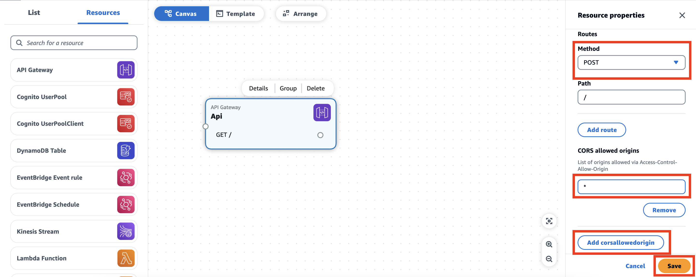
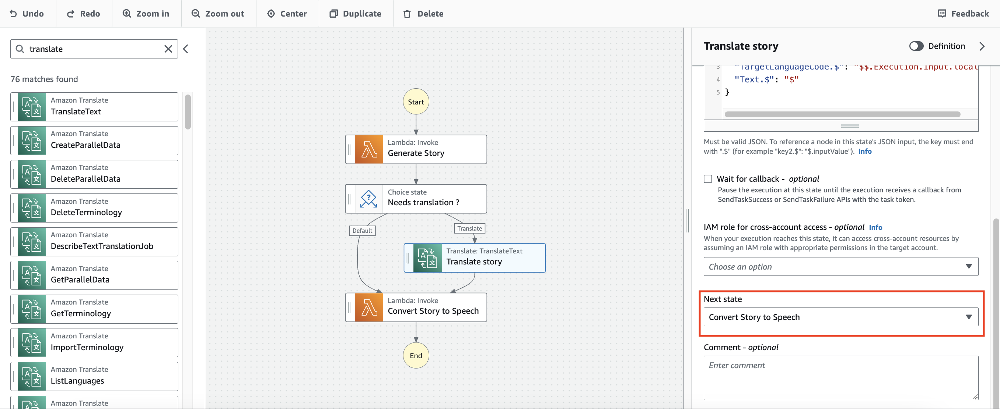

# Build a serverless MVP with AWS Application Composer

## Prerequisites

In order to proceed with the demo, you should have the following:
- [AWS CLI](https://docs.aws.amazon.com/cli/latest/userguide/getting-started-install.html) installed
- [AWS SAM](https://docs.aws.amazon.com/serverless-application-model/latest/developerguide/install-sam-cli.html) installed
- [Configure your AWS credentials](https://docs.aws.amazon.com/cli/latest/userguide/cli-chap-configure.html)
- Have an API key for the [external LLM (Large Language Model)](https://platform.openai.com/) we will be using during the demo.
- Download the contents of this directory to use it when going over the demo.

## What we are building

In this demo, we want to assess how we can use AWS Application Composer and other AWS tools in order to create an MVP on AWS. For the purpose of this demo, we want to be able to generate children stories in mp3 format by giving in the context of our story as well as the language in which we want our story to be narated. We want to be able to access our mvp on any browser.

## Architecture

This is the architecture of the solution we are going to build:


## Demo

### Store your API key in Secrets Manager

During this demo, we will be performing API calls to an external LLM API. We will need to use and API key but do not want to store those credentials in plain text in our application code.

1. Head to the [AWS Secrets Manager console](https://console.aws.amazon.com/secretsmanager/home)
2. Click on **Store an new secret**
3. Select **Other type of secret**
4. Choose **Plaintext**.
5. Enter your secret API key coming form the external LLM provider. Note that we are not using key/value pairs out of simplicity as we only have 1 secret to store.
    
6. Click next
7. Enter the secret name: **MvpStories/LLMKey**
8. Enter desciption: **Key to call external LLM API for MVP Stories demo**
   
9.  Click Next
10. Click Next
11. You should see a recap of your secret as well as a sample code you can use to retrieve your secrets in your application (eg: in a lambda function)
12. Click Store


### Build the backend with Application Composer - Part 1

Now we will start building the backend of our solution. In order to do so, we will be leveraging [AWS Application Composer](https://aws.amazon.com/application-composer/).

1. Let's start by downloading the contents of this directory on your local computer. Alternatively, start by creating a directory on your local computer called `mvp-stories`. This directory should contain two subdirectories, one for our frontend, one for our backend. Create the two directories:
   - `mvp-stories/backend`
   - `mvp-stories/frontend`
2. Head to the [Application Composer console](https://console.aws.amazon.com/composer/home)
3. Click on **create project**
4. Select **New Blank Project**
5. Select **Connected**
6. Select the **mvp-stories/backend** folder
7. Click **Create**

8. Drag and drop an API Gateway resource into the canvas

9. Click on the resource
10.  Click on **Details**
11.  Enter the logical ID to be **MvpStoriesApi**

12.  Scroll down to the routes section and change the **GET** method to **POST**
13.  Click on Add **corsallowedorigins** and set value to **\***
    > NOTE: All origins allowed for simplicity and the purpose of this demo, can be changed later to only allow the actual frontend making the requests
14.  Repeat for **CORS allowed headers** and **CORS allowed methods**
15.  Click save

16.  Add the lambda resource that will be triggered from API Gateway.
    
17.  Click on **Details**
18.  Enter the logical ID to be **MvpStoriesWorkflowTrigger**
19.  Update **Source path** field to `src/handlers`. This is the location where your lambda code will be stored locally.
20.  Update **Handler** field to `workflowTrigger.handler`. This is the name of the js file containing the lambda code and the relative handler method that is exposed
21.  Click save
    
22.  Connect the created **MvpStoriesApi** to the **MvpStoriesWorkflowTrigger**
    
23.  Add a Step Function resource to the canvas
    
24.  Click on **Details**
25. Set the logical ID the Step Function resource to **MvpStoriesWorkflow**
26. Click save
    
27. Link the **MvpStoriesWorkflowTrigger** resource to **MvpStoriesWorkflow** resource
    
28. Drag and drop 3 lambda functions resources, similarly to the firstly created lambda function resource. Change the following details respectively for every function:
    - Logical ID to **MvpStoriesGenerator**, Source path to `src/handlers` and Handler to `generator.handler`
    - Logical ID to **MvpStoriesTranslator**, Source path to `src/handlers` and Handler to `translator.handler`
    - Logical ID to **MvpStoriesTextToSpeech**, Source path to `src/handlers` and Handler to `textToSpeech.handler`
29. Your canvas should look something like this:
    


### Build the Step Function workflow logic

Currently the Step Function workflow resource in your Application Composer canvas contains a basic state machine definition. We actually want to create a state definition that matches our use case presented in the architecture.

1. Let's open a new tab and head to the Step Function console.
2. Click on Create state machine
    
3. Choose authoring method as **Design your workflow visually**
4. Choose **Express** type of workflow (as for the sake of this demo, we will be running everything syncronously)
5. Click next
    
6. Drag and drop a Lambda invoke action in your workflow.
7. Set the name of the state to **Generate Story**
8. Under API parameters, choose the function name to be **Enter** and **TBD** as shown on the image below:
    
    > Note that this is a fake lambda function name that will be overwritten automatically when using the state function definition in Application Composer and linking the Step Function resource with the previously created lambda functions.
9. Add a choice state after the **Generate Story** action
10. Click on edit Rule #1
    
11. Click on Add conditions
    
12. Set condition for rule one as follows:
    - Not: **NOT**
    - Oariable: **$.locale**
    - Operator: **is equal to**
    - Value: **String constant**
    - **en**
13. Click **Save conditions**
    
14. Change description of rule to **Story should be translated**
    
15. Drag and drop a Lambda invoke action in your workflow after Rule #1.
16. Set the name of the state to **Translate Story**
17. Under API parameters, choose the function name to be **Enter** and **TBD** as shown on the image below:
    
18. Drag and drop a Lambda invoke action in your workflow after Default Rule.
19. Set the name of the state to **Synthetize speech from text**
20. Under API parameters, choose the function name to be **Enter** and **TBD** as shown on the image below:
    
21. Select **Translate Story** state and scroll down to **Additional Configuration**
22. Select **Next state** to be **Synthetize speech from text**
    
23. Now that our workflow is setup, we can export it by clicking on **Import/Export**
24. Click on **Export YAML definition**
    
25. Copy the contents of the downloaded file

### Build the backend with Application Composer - Part 2

1. Go back to your Application Composer project.
2. Click on your **MvpStoriesWorkflow** resource
3. Paste the content of the downloaded state machine definition into the input field of your resource
4. Click on save
    
5. Link the states in **MvpStoriesWorkflow** with the corresponding Lambda resources
    
    > Note: This is where Application composer will update the dummy function name **TBD** we had set out when defining Lambda invoke states in our Step Function workflow and place a dynamic reference to the Lambda resources that will be created from the SAM template generated by Application Composer.
6. Now we need to add an S3 resource to our canvas
7. Let's give it a Logical ID of **MvpStoriesBucket**
8. Click Save
    
9.  Link it to the **MvpStoriesTextToSpeech** resource
    
    > Note: If you open the **MvpStoriesTextToSpeech** resource details, you will be able to see that Application Composer will automatically have added 2 environment variables as well as an IAM Policy allowing the lambda function to perform CRUD operations on the linked S3 bucket. You did not have to worry about doing this yourself!
    

All the AWS resources (AWS Secrets Manager, Amazon Polly and Amazon Translate) we will connect to are not available yet in Application Composer. We still need to allow our resources to access them, let's add some permission from within Application Composer.

10. Click on **MvpStoriesGenerator** resource details and scroll down to the **Permissions** section.
11. Paste the following code snippet:
    ```yaml
    - Statement:
      - Effect: Allow
        Action:
          - secretsmanager:GetSecretValue
        Resource:
          - !Sub arn:aws:secretsmanager:${AWS::Region}:${AWS::AccountId}:secret:MvpStories/LLMKey-??????
    ```
12. Click save
    
13. Click on **MvpStoriesTranslator** resource details and scroll down to the **Permissions** section.
14. Paste the following code snippet:
    ```yaml
    - Statement:
      - Effect: Allow
        Action:
          - translate:*
        Resource:
          - '*'
    ```
15. Click save
    
16. Click on **MvpStoriesTextToSpeech** resource details and scroll down to the **Permissions** section.
17. Add the following code snippet to the existing permission (S3):
    ```yaml
    - Statement:
      - Effect: Allow
        Action:
          - polly:*
        Resource: 
          - "*"
    ```
18. Click save
    

### Finalize the backend locally

By now, Application Composer should have created a `template.yaml` file. This file is IaC (Infrastructure as Code) describing your serverless architecture using [AWS SAM (Serverless Application Model)](https://aws.amazon.com/serverless/sam/).

There are a few things that we need to modify in this template to make our application behave as we want to (and that we unfortunately cannot do directly in Application Composer at the time of writing this document).

1. Open your `template.yaml` 
2. Search for the key `Resources.MvpStoriesWorkflow.Properties.Type` and change it from **STANDARD** to **EXPRESS**.
    > Note: For the sake of this demo, we are running our application syncronously. In order to be able to call our Step Function workflow syncronously, we need it to be of Type EXPRESS.
3. Search for the key `Resources.MvpStoriesWorkflowTrigger.Properties.Policies` and change the content of this key from
    ```yaml
    Policies:
      - StepFunctionsExecutionPolicy:
          StateMachineName: !GetAtt MvpStoriesWorkflow.Name
    ```
    to
    ```yaml
    Policies:
      - Statement:
          - Effect: Allow
            Action: states:StartSyncExecution
            Resource: !GetAtt MvpStoriesWorkflow.Arn
    ```
    With this change we are allowing the lambda function to call our step function workflow in a syncronous way.
4. Head to the end of the `template.yml` document and paste the following code:
    ```yaml
    Outputs:
      MvpStoriesApi:
        Description: "API Gateway endpoint URL for Prod stage"
        Value: !Sub "https://${MvpStoriesApi}.execute-api.${AWS::Region}.amazonaws.com/Prod/"
    ```
    This change will make sure that everytime you deploy your application with SAM, the API Gateway endpoint will be displayed.

Now that we have our IaC settled, there is a last thing we need to take care of before being able to deploy. In application composer, we have defined 4 lambda resources. We have defined their configuration but we did not define the actual code contained in those lambda functions. Let's do this now.

1. Remove the `src/` directory that has eventually been created for you by Application Composer  from your `backend` directory.
2. Create a `src/handlers` directory and **cd** into that directory
3. Run the following 2 commands
    ```sh
    npm init
    npm install node-fetch uuid
    ```
4. Create a `src/handlers/workflowTrigger.mjs` file and type in the following code
    ```js
    import { SFNClient, StartSyncExecutionCommand } from "@aws-sdk/client-sfn"

    export const handler = async (event) => {
      const body = JSON.parse(event.body)
      const sfnInput = {
        stateMachineArn: process.env.STATE_MACHINE_ARN,
        input: JSON.stringify({ context: body.context, locale: body.locale || 'en' })
      }
      const sfnClient = new SFNClient()
      const sfnCommand = new StartSyncExecutionCommand(sfnInput)
      const sfnResponse = await sfnClient.send(sfnCommand)
      return {
        statusCode: 200,
        headers: {
          "Access-Control-Allow-Headers" : "*",
          "Access-Control-Allow-Origin": "*", 
          "Access-Control-Allow-Methods": "*"
        },
        body: JSON.stringify(JSON.parse(sfnResponse.output))
      }
    }
    ```
    This code will handle the request incoming from API Gateway, call the Step Function workflow syncronously and return the formatted results.
5. Create a `src/handlers/generator.mjs` file and type in the following code
    ```js
    import {
      SecretsManagerClient,
      GetSecretValueCommand,
    } from "@aws-sdk/client-secrets-manager"

    export const handler = async (event) => {
      const LLMSecret = await getLLMSecret()
      const response = await fetch("https://api.openai.com/v1/completions", {
        method: 'POST',
        headers: {
          'Content-Type': 'application/json',
          'Authorization': `Bearer ${LLMSecret}`
        },
        body: JSON.stringify({
          "model": "text-davinci-003",
          "prompt": `Can you write an 80-120 words long children story about ${event.context}`,
          "max_tokens": 1000,
          "temperature": 0
        })
      })

      const responseJson = await response.json()
      return { ...event, story: responseJson.choices[0].text }
    }


    const getLLMSecret = async () => {
      const SecretId = "MvpStories/LLMKey"
      const client = new SecretsManagerClient({ region: process.env.AWS_REGION })
      try {
        return (await client.send(new GetSecretValueCommand({ SecretId }))).SecretString
      } catch (error) {
        throw error
      }
    }
    ```
    This code will request the API for the external LLM to Secrets Manager. It will then make a request to the external LLM to generate a 80-120 words long children story by including the input context and will add the story and return it along with the input event.
6. Create a `src/handlers/translator.mjs` file and type in the following code
    ```js
    import { TranslateClient, TranslateTextCommand } from "@aws-sdk/client-translate"

    export const handler = async (event) => {
      let translateResponse = {}
      if (['fr', 'nl', 'ar', 'it'].includes(event.locale)) {
        const translateInput = {
          SourceLanguageCode: 'en',
          TargetLanguageCode: event.locale,
          Text: event.story
        }
        const translateClient = new TranslateClient()
        const translateCommand = new TranslateTextCommand(translateInput)
        translateResponse = await translateClient.send(translateCommand)
      }
      return { ...event, translatedStory: translateResponse.TranslatedText }
    }
    ```
    This code will take an check if the the story needs to be translated and translate it accordingly. It will then return the translated story along with the input event.
7. Create a `src/handlers/textToSpeech.mjs` file and type in the following code
    ```js
    import { PollyClient, SynthesizeSpeechCommand } from "@aws-sdk/client-polly"
    import { S3Client, GetObjectCommand } from "@aws-sdk/client-s3"
    import { Upload } from "@aws-sdk/lib-storage"
    import { getSignedUrl } from "@aws-sdk/s3-request-presigner";
    import { v4 as uuidv4 } from 'uuid'

    export const handler = async (event) => {   
      const pollyInput = {
        Engine: "neural",
        OutputFormat: 'mp3',
        Text: event.translatedStory || event.story,
        VoiceId: getVoiceId(event.locale),
      }
      const pollyClient = new PollyClient()
      const pollyCommand = new SynthesizeSpeechCommand(pollyInput)
      const pollyResponse = await pollyClient.send(pollyCommand)
      
      const mp3FileName = `${uuidv4()}.mp3`
      const signedUrlExpiresIn = 60 * 5

      const s3UploadInput = {
        Body: pollyResponse.AudioStream,
        Bucket: process.env.BUCKET_NAME,
        Key: mp3FileName,
        ContentType: 'audio/mpeg'
      }
      const s3Client = new S3Client()
      const s3Upload = new Upload({
        client: s3Client,
        params: s3UploadInput,
      })
      await s3Upload.done()

      const s3GetObjectInput = { Bucket: process.env.BUCKET_NAME, Key: mp3FileName }
      const s3GetObjectCommand = new GetObjectCommand(s3GetObjectInput)
      const mp3Url = await getSignedUrl(s3Client, s3GetObjectCommand, { expiresIn: signedUrlExpiresIn })
      
      return { ...event, mp3Url }
    }

    const getVoiceId = locale => {
      if (locale == 'fr') return "Lea"
      if (locale == 'nl') return "Laura"
      if (locale == 'ar') return "Hala"
      if (locale == 'it') return "Bianca"
      return "Joanna"
    }
    ```
    This code will syntetize speech of the translated story or original story, it will upload the results to an S3 bucket and will generate a presigned URL on which users will be able to access the audio version of the children story and return that along with the input event.

### Deploying the backend

Now that we have everything in place we can deploy our backend. In order to do so we will need to run 2 commands:
1. From the root of your `backend` directory, run `sam build`
2. Run `sam deploy --guided`
   This command will ask for some information regarding your deployment, you can fill the values in as follows:
   
   > Note: It will warn you that MvpStoriesWorkflowTrigger has no Authorization defined. Explicetely allow it for the sake of this demo.

At the end of your deployment results, you should be able to find the outputs that should look like this:

Copy the API endpoint and test your api with the following command
```sh
  curl --location 'API_ENDPOINT' \
  --header 'Content-Type: application/json' \
  --data '{
      "context": "a baby sphynx lost in an Egyptian pyramid",
      "locale": "fr"
  }'
```
The result should contained a presigned URL to access the mp3 version of your story.

### Deploying the frontend

Now that you have a fully functional API, let's include that in our frontend. For the sake of this example, we have created a very basic vue3 application with a basic UI that we will be deploying with AWS Amplify Hosting.

1. Let's head to our Vue application and more specifically to the part of our application submitting our request to our API.
2. Let's update the API endpoint to the one generated by SAM when deploying our backend.
3. Now that our frontend is ready, let's build the static files in order to be able upload them on AWS Amplify Hosting. With vue3, this can be done running the `npm run build` command. This will create the necessary html, css and js files in a `dist` directory.
4. Let's now head to the [Amplify console](https://console.aws.amazon.com/amplify/home?#/create).
5. Select option **Deploy without Git provider**
6. Click on Continue
  
7. Enter the name of your Amplify application, eg: **Mvp Stories**
8. Drag and drop the `dist` folder containing your html, css and js files to be used for hosting.
9. Click **Save and deploy**
  
10. Once deployed, you will see a page telling you that the deployment is successful and will be able to access your app on the link provided.
  

You should now be able to test out your app, which makes a request to your backend and displays an mp3 story you can play from your webapp.


## Potential improvements

For the sake of the demo, we have kept many things simple and have taken some shortcuts. This is intended as the main value out of this demo is for you to understand how you can leverage Application Composer and other serverless technologies to quickly build your MVP.

It is not intended to be a guide for you to build a production ready product as many things could/should be improved before doing so. 

A few ideas on how to improve on the current solution:
- Do not deploy your solution manually but integrate your git provider with a CI/CD pipeline responsible for deploying your solution:
  - The `sam pipeline` command can help you setup a deployment pipeline. More information about this [here](https://aws.amazon.com/blogs/compute/introducing-aws-sam-pipelines-automatically-generate-deployment-pipelines-for-serverless-applications/)
  - Amplify hosting can be directly connected to your git provider, meaning that on every push, it would re-build your frontend and deploy it for you.
- Have different deployments for different environments
- Let your application work `async` by submitting the request, integrating API Gateway with Step Functions directly (without the need to go through a lambda invocation) and working with websockets to notify the user when the story has been generated.
- Directly call AWS services like Amazon Polly and Amazon Translate from your Step Function workflow (this requires more knowledge on how the Step Function service works)
- ...
